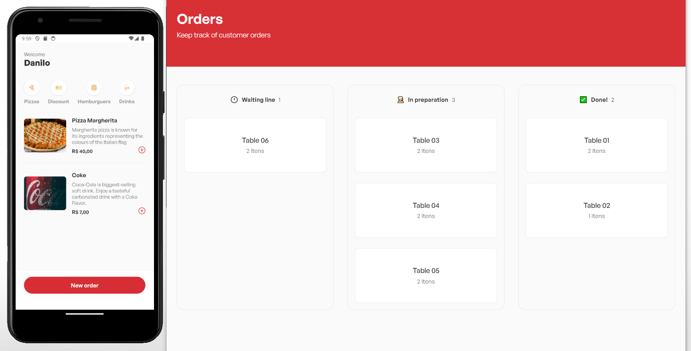

<h1 align="center">
    
</h1>

<br>

## 🧪 Tecnologies

This project was developed with the following technologies:

- [Typescript](https://www.typescriptlang.org/)
- [React Native](https://reactnative.dev/)
- [ReactJS](https://react.dev/)
- [NodeJS](https://nodejs.org/en)
- [Express](https://expressjs.com/)
- [Expo](https://expo.dev/)
- [Docker](https://www.docker.com/)
- [Mongodb](https://www.mongodb.com/)
- [Stocket.io](https://socket.io/)
- [Styled Components](https://styled-components.com/)

## 🚀 Running the project

Clone the repo

```bash
$ git clone https://github.com/daniilomello/waiter-app
```

To run the project, follow the steps below:

```bash
# Install the dependencies
$ cd waiter-app/server
$ yarn
```

Use Docker for the database - [Mongodb](https://www.mongodb.com/)
```bash
# Download the image
$ docker pull mongo

# Create the container
$ docker run --name mongowaiter -p 27017:27017 -d mongo

# Check if the container is already running
$ docker ps

# If is not, start the container
$ docker start pg
```

Start the express server
```bash
$ yarn dev
# Server wil be running on http://localhost:3001
```

Start the React app
```bash
# Access the React app folder
$ cd waiter-app/web

# Install the React Vite dependencies
$ yarn

# Run the application
$ yarn dev
# App will be running on http://127.0.0.1:5173/
```

Start the React Native mobile app
```bash
# Access the mobile app folder
$ cd waiter-app/mobile

# Install the project dependencies
$ yarn

# Run the expo
$ yarn expo start
```

## 📝 License

This project is licensed under the MIT.

---

Build with 💜 by Danilo Mello 👋🏻
